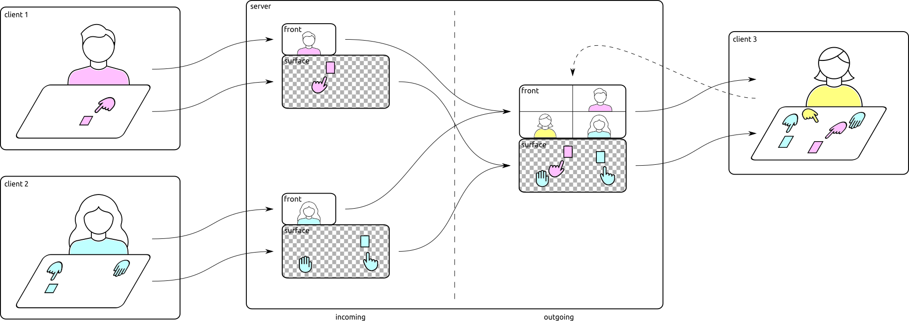

# SurfaceStreams

A framework to mix and distribute live video feeds from interactive surfaces via WebRTC.


Image credit: ©️ Stadt Regensburg, ©️ Stefan Effenhauser (see also the [VIGITIA](https://vigitia.de/) project)

SurfaceStreams consists of a mixing server, and one or more clients. Each clients sends one audiostream and two video streams: a plain old webcam feed of the user called the _front stream_, and a second feed of a rectified interactive surface called the _surface stream_. The surface stream is expected to have any background removed and chroma-keyed with 100% bright green.

The mixing server then composes a new surface stream for each client, consisting of the layered surface streams of the _other_ clients, and streams that back to each client (along with a single combined front stream of all individual front streams arranged side-by-side).



## HowTo

Here's an example walkthrough of how to connect an interactive surface with a browser client:

 * on a server host with sufficient CPU resources, run the mixing backend: `./webrtc_server.py`
 * start the browser client:
   * with Chrome or Firefox, go to `https://${SERVER_HOST}:8080/stream.html`
   * allow access to camera/microphone
   * you should then see your own webcam stream and a black canvas after a few seconds
   * try doodling on the black canvas (left mouse button draws, right button erases)
 * start the interactive surface:
   * setup and calibrate [SurfaceCast](https://github.com/floe/surfacecast) to stream the surface on virtual camera `/dev/video20` (see Usage - Example 2)
   * run the Python client: `./webrtc_client.py -t ${SERVER_HOST} -s /dev/video20 -f /dev/video0` (or whatever device your plain webcam is)
   * put the `surface` window as fullscreen on the surface display, and the `front` window on the front display
 * connect additional browser and/or surface clients (up to 4 in total)

## Clients

### Python commandline client parameters

```
  --fake                use fake sources (desc. from -f/-s)
```
Mostly useful for testing, will create default outgoing streams with fake test data (TV test image, moving ball, tick sounds).
If any of `-f/-s/-a` are also given, the string will be interpreted as a GStreamer bin description.

```
  -m, --main            flag this client as main (lowest z)
```
If a client does not have background filtering (i.e. a plain webcam), then you can use this flag to make sure that the surface stream from this client is always placed below all others. Note you can only have one "main" client per session, otherwise the surface mixing will get messed up.

```
  -a AUDIO, --audio AUDIO
  -f FRONT, --front FRONT
  -s SURFACE, --surface SURFACE
                        audio/front/surface source (device name or pipeline)
```
If any of these are given without ``--fake``, they will be interpreted as a device name (e.g. `/dev/video0`). Otherwise, they will be interpreted as a GStreamer bin description (e.g. `"videotestsrc ! timeoverlay"`). Note that in the second case the whole string needs to be quoted.

```
  -p PORT, --port PORT  server HTTPS listening port (8080)
  -t TARGET, --target TARGET
                        server to connect to (127.0.0.1)
```
Used to give the hostname or IP address of the server, and optionally a non-default port to connect to.

```
  -u STUN, --stun STUN  STUN server
```
If you want to use a different STUN server than the default (stun://stun.l.google.com:19302), specify here.

```
  -n NICK, --nick NICK  client nickname
```
Can be used to give a label (e.g. "Alice" or "Bob") to the frontstream.

```
  --persp PERSPECTIVE   perspective transformation
```
Can be used to "outsource" the perspective transformation of the surface feed to the server. PERSPECTIVE needs to be a transformation matrix as nine comma-separated float values in row-major order. Note: when your perspective transform happens to start with a minus, the argument parser gets confused. Use it with an explicit equals sign as in `--persp="-1,0,0,1,0,0,0,0,1"`.

## Server

```
  -s, --sink            save all streams to MP4 file (default: False)
  -o OUT, --out OUT     MP4 output filename (default: surfacestreams-20220327-125732.mp4)
```
If `-s/--sink` is given, write the combined front, surface, and audio streams to a MP4 file. Optional target filename can be set via `-o/--out`. Note that the file contains OPUS audio inside an MP4 container, which is not supported by all players. If necessary, use `scripts/playback.sh` to recode to MP3 and play all streams simultaneously in VLC.

```
  -p PORT, --port PORT  server HTTPS listening port (default: 8080)
  -u STUN, --stun STUN  STUN server (default: stun://stun.l.google.com:19302)
```
If you want to use a different STUN server than the default (stun://stun.l.google.com:19302), or a different listening port, specify here.

## Requirements

* Mixing server & standalone client
  * Ubuntu 22.04 LTS (Python 3.10, GStreamer 1.20)
  * Ubuntu 20.04 LTS (Python 3.8, GStreamer 1.16)
  * Debian 11 "Bullseye" (Python 3.9, GStreamer 1.18)
  * Install dependencies: `sudo apt install gstreamer1.0-libav gir1.2-soup-2.4 gir1.2-gstreamer-1.0 gir1.2-gst-plugins-bad-1.0 gir1.2-gst-plugins-base-1.0 gir1.2-nice-0.1 libnice10 gstreamer1.0-nice gstreamer1.0-plugins-bad gstreamer1.0-plugins-good gstreamer1.0-plugins-ugly`

* HTML5 client
  * Chrome 92 - 102
  * Firefox 94 - 96
  * Safari 15 - 16
  * Firefox 78 ESR, 102 ESR (Note: remember to enable OpenH264 plugin in `about:plugins`)
  * Chromium (Note: remember to install `chromium-codecs-ffmpeg-extra`, see [issue #8](https://github.com/floe/surfacestreams/issues/8))

## Known issues

  * Server
    * WebRTC (or more specifically, the STUN protocol) is primarily designed to deal with peers behind home NAT connections. If the server itself is heavily firewalled, this might need adjusting.
    * The server will repeatedly issue the warning `[...]: loop detected in the graph of bin 'pipeline0'!!`, which can be safely ignored.
    * Some race conditions when setting up the mixers still seem to be present, but hard to pin down. This happens particularly when a client connects within a few seconds of the previous client, before negotiation has completed. Usually shows up as a black surface stream, restart the client in this case.
  * Python Client
    * Using webcams as live sources (e.g. for the front stream) is somewhat hit-and-miss and depends on the pixel formats the webcam can deliver. Reliable results so far only with 24-bit RGB or 16-bit YUYV/YUV2. The front/face cam needs to support 640x360 natively, the surface cam needs to support 1280x720 natively. Good results with Logitech C270 (front/face) and C920 (surface). Note: environment variable `GST_V4L2_USE_LIBV4L2=1` can sometimes be used to fix format mismatch issues.
    * A Raspberry Pi 4 is just barely fast enough to handle the incoming and outgoing streams _plus_ the SurfaceCast perspective transform. Some additional notes: 
        * Overclocking to at least 1800 core/600 GPU is recommended (and don't forget to add active cooling, otherwise it will just go into thermal throttling right away, and you're back to square one).
        * "Outsource" the perspective transform to the server using the `--persp` parameter.
        * Don't plug the cameras into the USB3 ports (blue), but into USB2 instead (cf. [forum post](https://forums.raspberrypi.com/viewtopic.php?t=275492))
        * Avoid using the analogue audio output, use HDMI instead (cf. [forum post](https://forums.raspberrypi.com/viewtopic.php?f=28&t=306408))
        * Don't use the hardware H.264 decoder, causes some resource contention/race condition in the V4L2 subsystem when used in parallel with two cameras (cf. [39c6020](https://github.com/floe/surfacestreams/commit/39c60206fb0797f97e825718ff5deba41b53008d))
